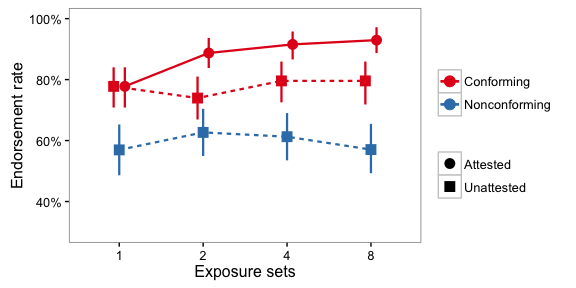
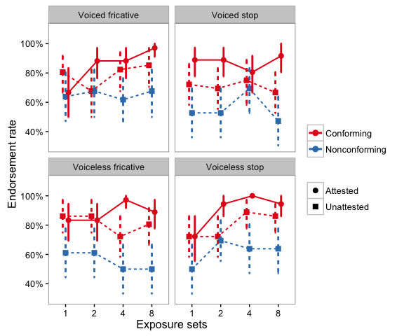
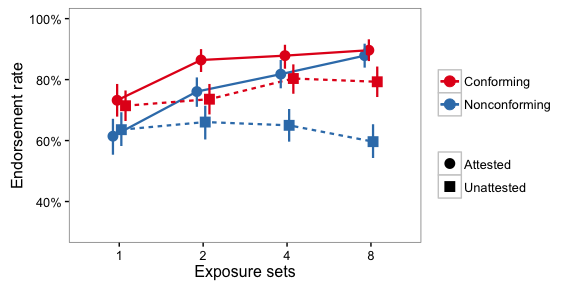
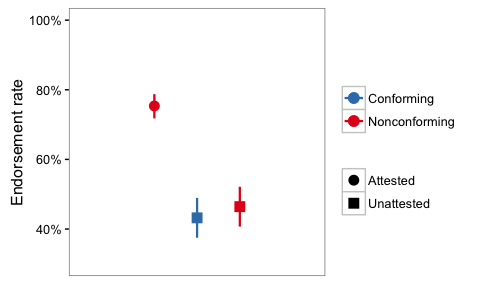
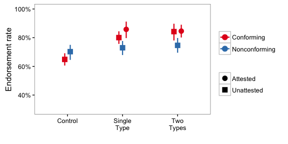
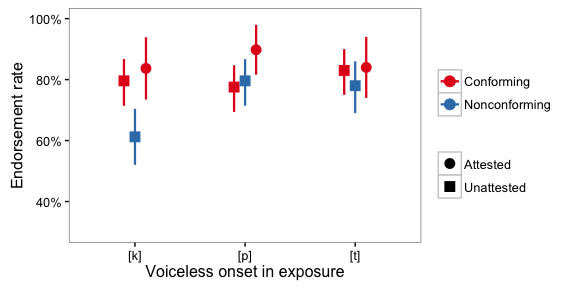

Rapid generalization in phonotactic learning,
=============================================

Code for generating the figures in: Linzen & Gallagher (2017), Rapid generalization in phonotactic learning, Laboratory Phonology

Experiment 1
------------

### Figure 1



### Figure 2



"Omnibus" ANOVA:

``` r
lmer_anova(exp1_results, fit_logistic, 'isyes', c('exposures', 'condition'),
           subject_slopes=c('condition'))
```

    ##                  term               p_value   chi chi_df warnings
    ## 1           condition 0.0000000000000000115 78.01      2    FALSE
    ## 2           exposures 0.0456270616660620076  8.02      3    FALSE
    ## 3 exposures:condition 0.0350320187643189326 13.55      6    FALSE

CONF-ATT vs CONF-UNATT:

``` r
lmer_anova(subset(exp1_results, condition != 'illegal'), fit_logistic,
           'isyes', c('exposures', 'condition'),
           subject_slopes=c('condition'))
```

    ##                  term   p_value   chi chi_df warnings
    ## 1           condition 0.0000188 18.31      1    FALSE
    ## 2           exposures 0.0142133 10.58      3    FALSE
    ## 3 exposures:condition 0.0192491  9.92      3    FALSE

Simple effects:

``` r
simple_effects(subset(exp1_results, (condition != 'illegal')), fit_logistic,
               'exposures', 'isyes', c('condition'),
               subject_slopes=c('condition'), null_bayes_factor=TRUE)   
```

    ##   exposures      term  p_value    chi chi_df bic null_bayes_factor
    ## 1         1 condition 0.331283  0.944      1 324          10.58611
    ## 2         2 condition 0.007295  7.199      1 291           0.46071
    ## 3         4 condition 0.081532  3.034      1 251           3.69671
    ## 4         8 condition 0.000106 15.020      1 246           0.00923
    ##   warnings
    ## 1    FALSE
    ## 2    FALSE
    ## 3    FALSE
    ## 4    FALSE

CONF-UNATT vs NONCONF-UNATT:

``` r
lmer_anova(subset(exp1_results, condition != 'attested'), fit_logistic,
           'isyes', c('exposures', 'condition'),
           subject_slopes=c('condition'))
```

    ##                  term      p_value    chi chi_df warnings
    ## 1           condition 0.0000000179 31.711      1    FALSE
    ## 2           exposures 0.9006392761  0.582      3    FALSE
    ## 3 exposures:condition 0.4219906048  2.809      3    FALSE

Simple effects:

``` r
simple_effects(subset(exp1_results, condition != 'attested'), fit_logistic,
               'exposures', 'isyes', c('condition'),
               subject_slopes=c('condition'))   
```

    ##   exposures      term  p_value   chi chi_df warnings
    ## 1         1 condition 0.000527 12.02      1    FALSE
    ## 2         2 condition 0.109300  2.56      1    FALSE
    ## 3         4 condition 0.004466  8.08      1    FALSE
    ## 4         8 condition 0.000804 11.23      1    FALSE

Voicing:

``` r
simple_effects(subset(exp1_results, condition != 'illegal'),  fit_logistic,
           'exposures', 'isyes', c('voicing', 'condition'),
           subject_slopes=c('condition'))
```

    ##    exposures              term  p_value      chi chi_df warnings
    ## 1          1         condition 0.332177  0.94039      1    FALSE
    ## 2          1           voicing 0.798219  0.06536      1    FALSE
    ## 3          1 voicing:condition 0.838637  0.04147      1    FALSE
    ## 4          2         condition 0.006854  7.31074      1    FALSE
    ## 5          2           voicing 0.424952  0.63658      1    FALSE
    ## 6          2 voicing:condition 0.400137  0.70791      1    FALSE
    ## 7          4         condition 0.018314  5.56585      1    FALSE
    ## 8          4           voicing 0.005902  7.57985      1    FALSE
    ## 9          4 voicing:condition 0.011308  6.41627      1    FALSE
    ## 10         8         condition 0.000117 14.84331      1    FALSE
    ## 11         8           voicing 0.941563  0.00537      1    FALSE
    ## 12         8 voicing:condition 0.632642  0.22849      1    FALSE

Manner:

``` r
simple_effects(subset(exp1_results, condition != 'illegal'), fit_logistic,
           'exposures', 'isyes', c('manner', 'condition'),
           subject_slopes=c('condition'))
```

    ##    exposures             term  p_value       chi chi_df warnings
    ## 1          1        condition 0.307601  1.040948      1    FALSE
    ## 2          1           manner 0.820820  0.051298      1    FALSE
    ## 3          1 manner:condition 0.100144  2.703254      1    FALSE
    ## 4          2        condition 0.006594  7.380434      1    FALSE
    ## 5          2           manner 0.700663  0.147783      1    FALSE
    ## 6          2 manner:condition 0.143424  2.140831      1    FALSE
    ## 7          4        condition 0.075450  3.160283      1    FALSE
    ## 8          4           manner 0.987722  0.000237      1    FALSE
    ## 9          4 manner:condition 0.381043  0.767335      1    FALSE
    ## 10         8        condition 0.000115 14.878918      1    FALSE
    ## 11         8           manner 0.769233  0.086071      1    FALSE
    ## 12         8 manner:condition 0.854369  0.033690      1    FALSE

Experiment 2a
-------------

### Figure 3



### Statistical analysis

``` r
no16 <- subset(exp2a_results, exposures != 16)
lmer_anova(no16, fit_logistic, 'isyes', c('type', 'attested'),
           subject_slopes=c('type', 'attested', 'type:attested'),
           item_var='consonant')
```

    ##            term  p_value      chi chi_df warnings
    ## 1      attested 0.000652 11.62067      1    FALSE
    ## 2          type 0.000577 11.84768      1    FALSE
    ## 3 type:attested 0.937072  0.00623      1    FALSE

Simple effects:

``` r
simple_effects(exp2a_results, fit_logistic, 'exposures', 'isyes',
               c('type', 'attested'), 
               subject_slopes=c('type', 'attested', 'type:attested'),
               item_var='consonant', null_bayes_factor=TRUE)
```

    ##    exposures          term     p_value     chi chi_df  bic
    ## 1          1      attested 0.900684220  0.0156      1 1468
    ## 2          1          type 0.018655279  5.5335      1 1473
    ## 3          1 type:attested 0.468176708  0.5263      1 1468
    ## 4         16      attested 0.000000532 25.1452      1 1074
    ## 5         16          type 0.171048127  1.8737      1 1051
    ## 6         16 type:attested 0.209397894  1.5756      1 1051
    ## 7          2      attested 0.000651156 11.6237      1 1272
    ## 8          2          type 0.008083842  7.0148      1 1267
    ## 9          2 type:attested 0.209778083  1.5730      1 1262
    ## 10         4      attested 0.003629848  8.4603      1 1189
    ## 11         4          type 0.002375575  9.2340      1 1189
    ## 12         4 type:attested 0.607061707  0.2645      1 1180
    ## 13         8      attested 0.000036723 17.0337      1 1127
    ## 14         8          type 0.002119372  9.4432      1 1120
    ## 15         8 type:attested 0.038537301  4.2811      1 1115
    ##    null_bayes_factor warnings
    ## 1          33.206805    FALSE
    ## 2           2.103852    FALSE
    ## 3          25.723474    FALSE
    ## 4           0.000116     TRUE
    ## 5          13.113935     TRUE
    ## 6          15.222123     TRUE
    ## 7           0.100126    FALSE
    ## 8           1.003144    FALSE
    ## 9          15.242132    FALSE
    ## 10          0.486947    FALSE
    ## 11          0.330722    FALSE
    ## 12         29.321002    FALSE
    ## 13          0.006696    FALSE
    ## 14          0.297887    FALSE
    ## 15          3.935224    FALSE

Simple effects within attested items:

``` r
simple_effects(subset(exp2a_results, attested == 'yes'), fit_logistic,
               'exposures', 'isyes', c('type'), subject_slopes=c('type'),
               item_var='consonant')
```

    ##   exposures term p_value    chi chi_df warnings
    ## 1         1 type  0.0465 3.9634      1    FALSE
    ## 2        16 type  0.8291 0.0466      1    FALSE
    ## 3         2 type  0.0115 6.3838      1    FALSE
    ## 4         4 type  0.0712 3.2558      1    FALSE
    ## 5         8 type  0.5596 0.3405      1    FALSE

Simple effects within unattested items:

``` r
simple_effects(subset(exp2a_results, attested == 'no'), fit_logistic,
               'exposures', 'isyes', c('type'),
               subject_slopes=c('type'), item_var='consonant')
```

    ##   exposures term   p_value   chi chi_df warnings
    ## 1         1 type 0.2204632  1.50      1    FALSE
    ## 2        16 type 0.0289845  4.77      1    FALSE
    ## 3         2 type 0.2219419  1.49      1    FALSE
    ## 4         4 type 0.0012839 10.37      1    FALSE
    ## 5         8 type 0.0000274 17.59      1    FALSE

Experiment 2b
-------------

### Figure 4



### Statistical analysis

``` r
base <- glmer(response ~ 1 + (1 + type | subject) + (1 | consonant),
              control=glmerControl(optimizer="bobyqa"),
              family=binomial, data=exp2b_results)
with_type <- update(base, . ~ type + .)
anova(base, with_type)
```

    ## Data: exp2b_results
    ## Models:
    ## base: response ~ 1 + (1 + type | subject) + (1 | consonant)
    ## with_type: response ~ type + (1 + type | subject) + (1 | consonant)
    ##           Df  AIC  BIC logLik deviance Chisq Chi Df Pr(>Chisq)    
    ## base       8 1322 1363   -653     1306                            
    ## with_type 10 1299 1349   -639     1279  27.6      2   0.000001 ***
    ## ---
    ## Signif. codes:  0 '***' 0.001 '**' 0.01 '*' 0.05 '.' 0.1 ' ' 1

Without attested:

``` r
no_attested <- subset(exp2b_results, attested == 'no')
base <- glmer(response ~ 1 + (1 + type | subject) + (1 | consonant),
              control=glmerControl(optimizer="bobyqa"),
              family=binomial, data=no_attested)
with_type <- update(base, . ~ type + .)
anova(base, with_type)
```

    ## Data: no_attested
    ## Models:
    ## base: response ~ 1 + (1 + type | subject) + (1 | consonant)
    ## with_type: response ~ type + (1 + type | subject) + (1 | consonant)
    ##           Df AIC BIC logLik deviance Chisq Chi Df Pr(>Chisq)
    ## base       5 749 770   -369      739                        
    ## with_type  6 750 776   -369      738  0.57      1       0.45

Averaging the two unattested categories:

``` r
base <- glmer(response ~ 1 + (1 + attested | subject) + (1 | consonant),
              control=glmerControl(optimizer="bobyqa"),
              family=binomial, data=exp2b_results)
with_attested <- update(base, . ~ attested + .)
anova(base, with_attested)
```

    ## Data: exp2b_results
    ## Models:
    ## base: response ~ 1 + (1 + attested | subject) + (1 | consonant)
    ## with_attested: response ~ attested + (1 + attested | subject) + (1 | consonant)
    ##               Df  AIC  BIC logLik deviance Chisq Chi Df Pr(>Chisq)    
    ## base           5 1317 1342   -654     1307                            
    ## with_attested  6 1292 1322   -640     1280  27.4      1 0.00000017 ***
    ## ---
    ## Signif. codes:  0 '***' 0.001 '**' 0.01 '*' 0.05 '.' 0.1 ' ' 1

Experiment 3
------------

### Figure 5



### Figure 6



Statistical analysis
--------------------

Factorial, without CONF-ATT:

``` r
lmer_anova_maybecorrel(subset(exp3_results, cond != 'attested'), fit_logistic,
                       'isyes', c('cond', 'n_voiceless'),
                       subject_slopes=c(), item_var='onset')
```

    ##   subject_slope_correl             term   p_value   chi chi_df warnings
    ## 1                 TRUE             cond 0.0349640  4.45      1    FALSE
    ## 2                 TRUE      n_voiceless 0.0000535 19.67      2    FALSE
    ## 3                 TRUE cond:n_voiceless 0.0034617 11.33      2    FALSE

Factorial, without Control language:

``` r
lmer_anova_maybecorrel(subset(exp3_results, n_voiceless != 0), fit_logistic,
                       'isyes', c('cond', 'n_voiceless'),
                       subject_slopes=c(), item_var='onset')
```

    ##   subject_slope_correl             term  p_value    chi chi_df warnings
    ## 1                 TRUE             cond 0.000832 14.183      2    FALSE
    ## 2                 TRUE      n_voiceless 0.601710  0.272      1    FALSE
    ## 3                 TRUE cond:n_voiceless 0.583169  1.079      2    FALSE

List effects:

``` r
lmer_anova_maybecorrel(subset(exp3_results, n_voiceless == 1), fit_logistic,
                       'isyes', c('cond', 'list'),
                       subject_slopes=c(), item_var='onset')
```

    ##   subject_slope_correl      term p_value  chi chi_df warnings
    ## 1                 TRUE      cond  0.0298 7.03      2    FALSE
    ## 2                 TRUE      list  0.2607 2.69      2    FALSE
    ## 3                 TRUE cond:list  0.1401 6.92      4    FALSE
